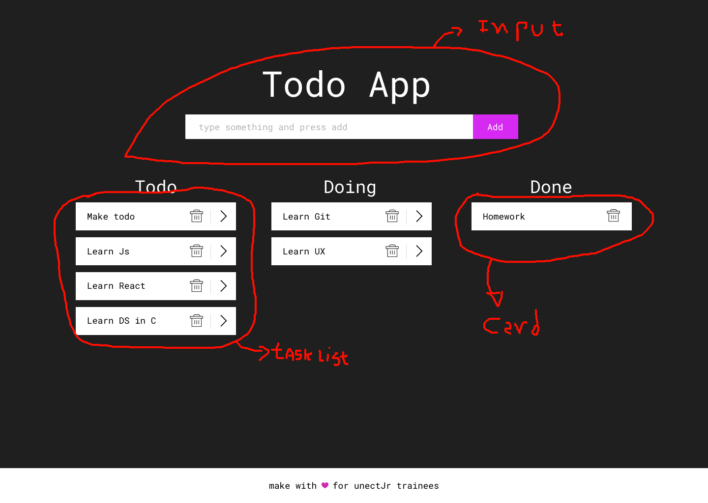

# Step 3: Componentização

Nesta etapa iremos dividir nosso aplicativo em multiplos componentes. O objetivo identificar as partes do código que se repetem e/ou que são partes funcionais que podem ser isoladas e divididos em [componentes atômicos]((!https://brasil.uxdesign.cc/atomicidade-espelhada-ui-e-front-falando-a-mesma-l%C3%ADngua-143551c59ab7)) 

E como funciona essa tal de divisão entre componentes? Segue a imagem abaixo



Temos 3 áreas e 5 componentes

* App
* Input dos dados
* Lista de Tarefas
* Card da Tarefa
* Icones

## Componentes

É importânte notar que existem dois tipos de componentes: os componentes de classe ou ```class components``` e os componentes funcionais ou ```functional components ```. De modo muito simplificado nosso objetivo com os componentes funcionais é que eles não tenham muitas funcionalidades e principalmente esses componentes não tem estado. Um exemplo deste tipo de componente é o componente de Icones. 

Por outro lado os componentes de classe possuem estado e geralmente são eles que se encarregam de guardar e gerênciar a maior parte da lógica, tanto da aplicação quanto dos componentes de funções. Além disso eles também permitem o uso dos ```lifecicle methods``` (topico que sera discutido mais a frente). Um exemplo deste tipo de componente a classe App.

Declaração de um componente funcional vs Componente de Classe
```javascript
/*
    é necessário que o react esteja no contexto do componente.
*/
import React from 'react'

const MyComponent = (props) => {
    // component markup
}
export default MyComponent
```
```javascript
/*
    é necessário que o react esteja no contexto do componente.
*/
import React, { Component } from 'react'

class MyComponent extends Component {
    // component logic/markup/state
}

export default MyComponent
```

## Estado
O estado são dados utilizados pelo componente esses dados podem ser strings, objetos, arrays, arrays de objetos, enfim qualquer tipo primitivo do javascript. O ```state``` de um componente é privado e completamente controlado pelo componente.

```javascript

import React, { Component } from 'react'
/*
    Forma 1:
*/
class Counter extends Component {
    state = {
    }
}
/*
    Forma 2:
*/
class Counter extends Component {
    constructor (props) {
        super(props)
        this.state = {
        }
    }
}

export default Counter
```
### Contator simples
Vamos tentar criar um contador simples com o estado. A ideia é ter 2 botões um de soma + 1 e outro de subtrai - 1 
segue o código.
```javascript

import React, { Component } from 'react'

class Counter extends React.Component {
  state = {
    counter: 0
  }
  render() {
    // pega o estado atual do contador
    const { counter } = this.state
    return (
      <div>
        // botão de -1
        <button onClick={() => this.setState({counter: counter - 1})}>-1</button>
        // mostra o valor atual do contator
        <span> {counter} </span>
        // botão de +1
        <button onClick={() => this.setState({counter: counter + 1})}>+1</button>
      </div>
    );
  }
}
export default Counter
```

Visite o live code do exemplo acima no [Codepen](https://codepen.io/luandryl/pen/LYPXvBd) e tente mexer nas propriedades e ver o que acontece (tente criar um botão de multiplicar).

## Propriedades

Assim como o estado as propriedades são dados utilizados pelos componentes. A diferença é que as propriedades são passadas ao componenete geralmente seguindo a hierarquia de pai pra filho. Ou seja o componente que recebe a propriedade pode utiliza-lo.

As props podem ser qualquer objeto primitivo do javascript e até mesmo funções. Também existem duas formas de utilizar as props.
```javascript
import React from 'react'

const MyComponent = (props) => {
    return (
        <span> props.name </span>
    )
}
export default MyComponent
```
Ou ainda
```javascript
import React, {Component} from 'react'

class MyComponent extends Component {
    constructor () {
        super(props)
    }

    rreturn (
        <span> this.props.name</span>
    )
}

export default MyComponent
```

### Contator simples

Continuando com a ideia do contador vamos tentar refatora-lo para que ele use o conceito de propriedades.
```javascript
/*
    Componente filho -> recebe e mostra o contador
*/
class ShowNumber extends React.Component {
  render () {
    return (
      <span> {this.props.counter} </span>
    )
  }
}
/*
    Componente pai -> guarda a logica do contador
*/
class Counter extends React.Component {
  state = {
    counter: 0
  }
  render() {
    const { counter } = this.state
    return (
      <div>
        <button onClick={() => this.setState({counter: counter - 1})}>-1</button>
        // aqui é onde passamos o contador como propriedade
        <ShowNumber counter={counter} />
        <button onClick={() => this.setState({counter: counter + 1})}>+1</button>
      </div>
    );
  }
}

React.render(<Counter />, document.getElementById('app'));
```

Visite o exemplo no [Codepen](https://codepen.io/luandryl/pen/LYPXvBd) e perceba como tudo esta funcionando, tente hackear esse exemplo e inserir um componente chamdo ```<ShowMult>```com o objetivo de mostrar somente os numeros multiplicados do exercicio anterior.

## Próximo passo.

Fizemos uma série de avanços aqui e começamos a entender um pouco mais do funcionamento do React porem nosso App ainda não tem funcionalidade nenhuma. Então nossa proxima tarefa será criar a funcionalidade de adicionar uma tarefa.

Para prosseguir

    $ git checkout step_4
#### Próximo
* [Step 4: Funcionalidades.](https://github.com/luandryl/mini-curso-react/tree/step_4)

#### Refs
* [Componentes Atômicos](https://brasil.uxdesign.cc/atomicidade-espelhada-ui-e-front-falando-a-mesma-l%C3%ADngua-143551c59ab7)
* [Statless/Class Components](https://hackernoon.com/react-stateless-functional-components-nine-wins-you-might-have-overlooked-997b0d933dbc)
* [Componentes Estados e Propriedades](http://felipegalvao.com.br/blog/2018/09/24/aprenda-react-componentes-state-e-props/)


#### Anteriormente
* [Step 0: Inicio da série](https://github.com/luandryl/mini-curso-react/tree/master)
* [Step 1: Criação do projeto](https://github.com/luandryl/mini-curso-react/tree/step_1)
* [Step 2: Construção do Layout](https://github.com/luandryl/mini-curso-react/tree/step_2)
