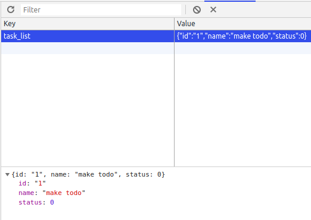

# Step 5: LocalStorage Service

Chegamos a ultima etapa do desenvolvimento do nosso TodoApp.
Agora iremos atender o ultimo requisito presente em nossa user storie, e, para isso nesta etapa iremos desenvolver um serviço para salvar as tarefas no localstorage do navegador.

Existem diversas formas de persistir dados no navegador e uma das mais utilizadas quando falamos de softwares com a arquitetura REST é o localstorage. Por este motivo iremos aprender como utilizar essa ferramenta em nossos projetos frontend.

## LocalStorage and SessionStorage

Essas duas api´s presentes nos navegadores atuais são muito parecidas com os cookies em sua forma de funcionamento, isso quer dizer quem ambas armazenam os dados no formato chave => valor. Porém elas resolvem diversos problemas e limitações que os cookies carregam.

Estas duas formas de armazenamento de dados client-side não enviam dados ao servidor, o que indica que é de responsábilidade do desenvolvedor manipular e manter a consistência dos dados ali presentes.

A diferença entre essas duas ferramentas se da na forma em que persistem os dados. O localStorage armazena os dados por um tempo indefinido até que o aplicativo que fez a requisição de armazenamento exclua este dado de lá. Já a session storage armazena os dados durante uma sessão do navegador apenas. Isso significa que se quisermos guardar dados que permanecam quando o computador for desligado (ex: o status de logado em algum sistema) deve-se utilizar a localStorage, por outro lado se quisermos fazer algum cache de alguma informação pertinente a usabilidade do sistema pode-se utilizar a sessionStorage.

Contudo temos algumas limitações ao usar estas duas ferramentas. Como quase tudo na computação são trade-offs aqui não seria diferente. Apesar de serem duas otimas formas de armazenar dados elas são limitadas ambas armazenam apenas 25mb e alem disso elas somente armazenam dados no formato chave => valor onde esse valor é um texto.
Porém esta última limitação citada pode ser contornada.

### GetItem, SetItem e RemoveItem.
Os navegadores oferecem uma API segura para guardar pares de `chave=>valor` por meio dos métodos `GetItem, SetItem, RemoveItem, Clear `. O Código abaixo ilustra como podemos guardar objetos na localStorage do navegador.
```javascript
const newTask = {
    id: '1',
    name: 'make todo',
    status: 0
}
localStorage.setItem('task_list', JSON.stringify(newTask))

```

Ao executar o código acima o resultado que teremos guardado no nosso navegador será igual o da imagem abaixo. Um ponto interessante de se notar é que conforme foi dito acima o localStorage apenas guarda pares de `chave=>valor` como strings, porém como podemos observar conseguimos guardar um objeto, como isso é possivel? Utilizamos a função `stringify` do objeto `JSON` para transformar o objeto `newTask` em string.
Logo para recuperar e manipular esses dados deve-se fazer o parse de volta de string para objeto.



O trecho de código abaixo recupera a lista de tarefas no localStorage do navegador, mostra na tela além de remover está lista do localStorage.
```javascript

const task_list = JSON.parse(localStorage.getItem('task_list'))
console.log(task_list)

// remove um item do localStorage.
localStorage.removeItem('task_list')
```


## LocalStorage Service
Agora que entendemos o funcionamento basico o objeto `localStorage` vamos começar a refatorar o código do ```step_4``` para atender ao nosso ultimo requisito funcional. Para isso vamos olhar para o trecho de código abaixo:

```javascript
        state = {
		list: []
	}

	saveTask = (task) => {
		const { list } = this.state
		const newTask = {
			id: id(),
			name: task,
			status: 0
		}
		this.setState({list: [ ...list, newTask]})
	}

	changeStatus = (id) => {
		const { list } = this.state

		const updateList = list.map(task => {
			if (task.id === id) 
				task.status = task.status + 1
			return task
		})
		this.setState({list: updateList})
	}

	deleteTask = (id) => {
		const { list } = this.state
		const updateList = list.filter(task => {
			return task.id !== id
		})
		this.setState({list: updateList})
	}

```

É aqui que encapsulamos toda a logica de manipulação do ```state``` de nosso aplicativo para que ele atenda nossos requisitos funcionais. Logo, nosso serviço deverá replicar esse comportamento do array ```list: [] ``` no localStorage. Porem iremos realizar algo um pouco mais sofisticado. Começamos criando o arquivo ```./services/LocalStorage.js```

### Save Task

Nossa primeira tarefa será refatorar a função ```saveTask```.

```javascript
/*
    função antiga -> App.js
*/
saveTask = (task) => {
    const { list } = this.state
    const newTask = {
        id: id(),
        name: task,
        status: 0
    }
    this.setState({list: [ ...list, newTask]})
}
/*
    nova função -> App.js
*/
saveTask = (task) => {
    if (task) {
        const newTask = {
            id: id(),
            name: task,
            status: 0
        }
        LocalStorage.save(newTask)
        this._loadData()
    } else {
        alert('oops! write something')
    }
    
}
```
Existem três pontos interessantes de se notar no código acima: 
#### LocalStorage.save(task)
Aqui definimos a forma que iremos trabalhar com o nosso serviço, ou seja, queremos um objeto que contenha funções à serem executadas pelo nosso componente.

#### this._loadData()
Logo após qualquer alteração no `state` tinhamos que fazer o updade desta informação. Este método realizará isso para nós e sua implementação será discutida posteriormente.

#### if (task) {

Não haviamos feito nenhuma verificação se o input era vazio, logo, tarefas sem título podem ser adicionadas, o que não faze o menor sentido, jpa que tarefas vazias nçao podem ser concluidas. Agora isso foi corrigido.

Eis o código do serviço que irá salvar no localStorage

```javascript
// função q salva uma lista dentro do localStorage
const saveList = (list) => {
    localStorage.setItem('task_list', JSON.stringify(list))
}

//função que cria um novo obj task
const save = (task) => {
    if (!localStorage.getItem('task_list')) {
        let task_list = []
        task_list = [...task_list, task]
        saveList(task_list)
    } else {
        let task_list = JSON.parse(localStorage.getItem('task_list'))
        task_list = [...task_list, task]
        saveList(task_list)
    }
}
```
### Remove
Para removermos um item da lista de tarefas utilizamos o `array.filter` para retirar da lista tarefa que deve ser removida.
```javascript
const remove = (id) => {
    let task_list = getList()
    if (task_list) {
        let newList = task_list.filter(task => {
            return task.id !== id
        })
        saveList(newList)
    }
    
}
```

### Change Status
De modo análogo a função de remover a troca de status. É interessante notar a diferença entre as funções `map`e `filter`
```javascript
const change = (id) => {
    let task_list = getList()
    const updateList = task_list.map(task => {
        if (task.id === id) 
            task.status = task.status + 1
        return task
    })
    saveList(updateList)
}
```

### App.js

Agora que terminamos de escrever o serviço responsável por se comunicar com a localStorage vamos refatorar o código prensente em `App.js`

```javascript

	state = {
		list: []
	}

	saveTask = (task) => {
		if (task) {
			const newTask = {
				id: id(),
				name: task,
				status: 0
			}
			LocalStorage.save(newTask)
			this._loadData()
		} else {
			alert('oops! write something')
		}
		
	}

	changeStatus = (id) => {
		LocalStorage.change(id)
		this._loadData()
	}

	deleteTask = (id) => {
		LocalStorage.remove(id)
		this._loadData()
	}

	clearTaskList = () => {
		LocalStorage.clear()
		this._loadData()
	}

	_loadData () {
		this.setState({list: LocalStorage.load()})
	}

	componentWillMount () {
		this._loadData()
	}
```
Se visitarmos o navegador nosso app deve estar funcionando conforme planejamos.

## Fim da Jornada.

Chegamos ao final de nossa jornada e com isso conversamos sobre os principios basicos de funcionamento do `React.js` e além disso conhecemos como funciona o processo de desenvolvimento frontend dentro da `unect jr`

Com certeza passamos por muitos tópicos complexos para quem está sendo exposto a este tipo de informação pela primeira vez, contudo quero frizar para que não desanimem e para que estudem os codigos que foram passados. É de suma importância tambem que vocês tentem por conta própria desenvolver os passos explicados aqui sem copiar/colar codigo, para que entendam os princípios basicos tanto de javascript quanto do react.js.

Qualquer duvida estou à disposição.

# Voa Unect
#### Refs
* [Client-Side storage](https://mattwest.design/choosing-the-best-client-side-storage-technology-for-your-project)

* [Local Storage](https://tableless.com.br/guia-f%C3%A1cil-sobre-usar-localstorage-com-javascript/)

* [Mozila LocalStorage](https://developer.mozilla.org/en-US/docs/Web/API/Web_Storage_API/Using_the_Web_Storage_API)

#### Anteriormente
* [Step 0: Inicio da série](https://github.com/luandryl/mini-curso-react/tree/master)
* [Step 1: Criação do projeto](https://github.com/luandryl/mini-curso-react/tree/step_1)
* [Step 2: Construção do Layout](https://github.com/luandryl/mini-curso-react/tree/step_2)
* [Step 3: Componentização](https://github.com/luandryl/mini-curso-react/tree/step_3)
* [Step 4: Funcionalidades.](https://github.com/luandryl/mini-curso-react/tree/step_4)