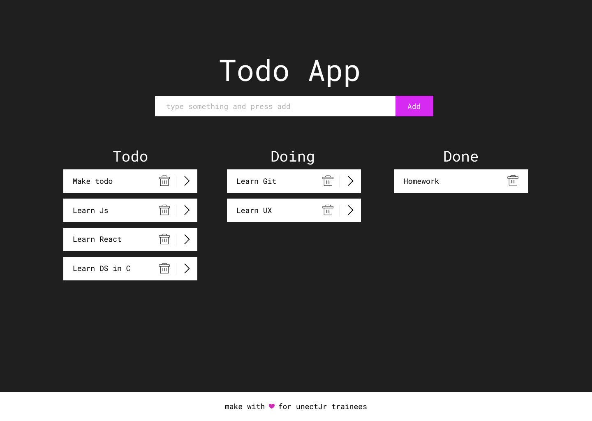

# Step 2: Construção do Layout

Nesta etapa iremos desenvolver a construção do HTML inicial de acordo com o Layout passado.



## HTML + CSS

É importante notar como foi feita a construção do html+css, pensemos no ```html como caixas dentro de um espaço 2D``` onde vamos guardando coisas, estas caixas podem conter outras caixas dentro delas ou algum item (botão, input, texto, tabela, etc). Porém estas ```caixas não possuem estilo ```, ou seja, elas, junto de seu conteúdo vão sendo ```"empilhadas" quando são renderizadas pelos navegadores```.

```Então entra o CSS``` que por definição é uma linguagem declarativa e sendo assim com esta linguagem é possivel ``` expressar logica sem escrever um controle de fluxo explicito ``` logo, seu objetivo é ir estilizando e controlando a forma de visualização das ```caixas ``` descritas acima de forma declarativa. 

## Code Style

Existem algumas maneiras (design patterns) para criar organizar códigos HTML+CSS como por exemplo a ideia de separar da estrutura do visual/separar exibição de conteúdo bem como os estilos de escrita OOCSS, SMACSS, BEM, DRY CSS. Para entender melhor recomendo a leitura [DESTE](https://tableless.com.br/oocss-smacss-bem-dry-css-afinal-como-escrever-css/) e [DESTE](https://tableless.com.br/oocss-ou-css-do-jeito-certo/) artigo.

Para fins de simplificação neste projeto não foi utilizado nenhum padrão descrito acima, mas, contudo, porém, no entanto, entretanto, todavia, não deixei de criar/utilizar de um padrão mesmo que minimalista para apresentar a importância do uso de padrões e de manter o código todo com uma logica estruturada, com comentários e o mais limpo possível inclusive em relação a html e css

Neste projeto então seguimos o seguinte padrão para a criação de HTML+CSS 

``` html

<div class="ElementoRaiz utilitario">
    <div class="ElementoRaiz--elementoFilho">
        <input class="ElementoRaiz__input" type="text" />
        <button class="ElementoRaiz__button"> ADD </button>
    </div>
</div>

```

``` css

.utilitario

.ElementoRaiz {}

.ElementoRaiz--elementoFilho {}

```

Ou ainda com um exemplo real de um trecho de código
``` html

<div className="App--task-input center">
    <h1> Todo App </h1>
    <div className="task-input--actions center">
        <input className="App__input" type="text" placeholder="type something and press add" /> 
        <button className="App__button" > Add </button>
    </div>
</div>
```
``` css

.center {}

.App--task-input {}

.task-input--actions {}

```

As classes CSS que não seguem este estilo de código são utilitários que complementam as classes CSS.
Como App é o elemento "pai" de todos os outros os botões e inputs recebem ```App__``` como préfixo.

## Icons Component

Na próxima etapa iremos componentizar o nosso app e o objetivo era não utilizar compoentes nesta etapa. Porém criar um componente de icones que retorna um dos três tipos de icones utilizados no projeto foi a solução mais simples/legal para o contexto do projeto. Isso se deve porque temos apenas três icones e mostra a versatilidade que podemos criar componentes para diferentes tipos de processos dentro da criação de interfaces.

Este compoente se encontra dentro da pasta ``` ./assets/icons/Icons.js ```

## Próximo passo

Nossa próxima tarefa nesta jornada sera dividir a interface em componentes com o objetivo de separar-los as responsabilidades funcionais de cada parte do código html para facilitar quando começarmos a escrever as fucionalidades do App. Além disso na proxima etapa veremos mais a fundo está questão de componentes e o que foi feito no componente de Icones ficará mais claro.

Para prosseguir:

    $ git checkout step_3

#### Próximo
* [Step 3: Componentização](https://github.com/luandryl/mini-curso-react/tree/step_3)

#### Refs

* [Wiki CSS](https://en.wikipedia.org/wiki/Cascading_Style_Sheets)
* [Declarative Langs](https://en.wikipedia.org/wiki/Declarative_programming)

#### Anteriormente
* [Step 0: Inicio da série](https://github.com/luandryl/mini-curso-react/tree/master)
* [Step 1: Criação do projeto](https://github.com/luandryl/mini-curso-react/tree/step_1)
