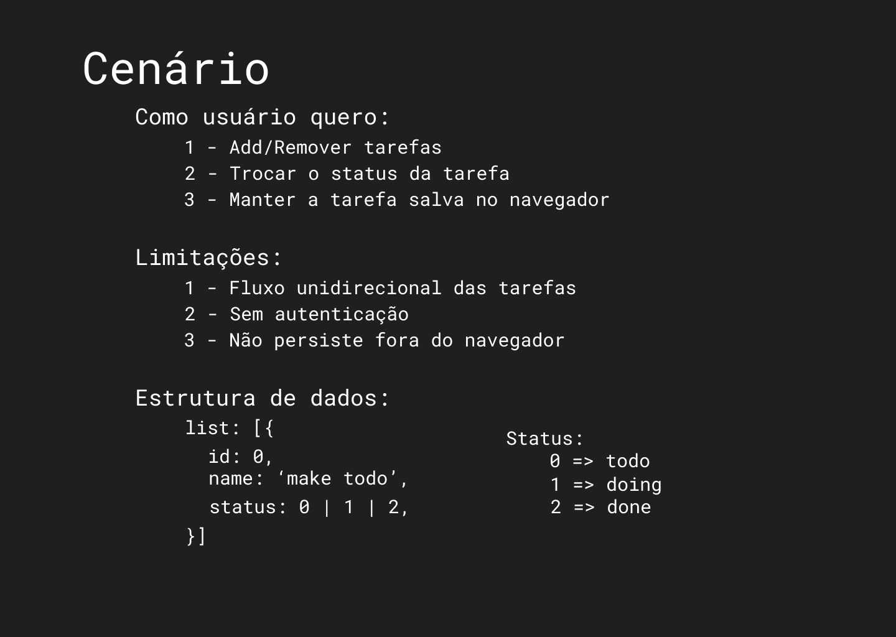

# Minicurso react UnectJR

Olá bem vindo ao extra do minicurso de react. Aqui iremos contruir um TodoApp passo a passo com comentários. O objetivo é mostrar algumas das principais funções do react e o que pode ser feito com ele e não ensinar react ou javascript própriamente dito, para isso existem diversos conteúdos disponíveis na internet (ex: [Documentação Oficial](https://pt-br.reactjs.org/tutorial/tutorial.html), visitem), os cursos na `udemy, alura, origamid` bem como a infinidade de canais BR e gringos que tem conteúdos sólidos sobre as tecnologias. 

Queremos seguir as premissas do desenvolvimento frontend dentro da diretoria de projetos, ou seja, um layout definido, regras para serem seguidas e limitações.

Para acompanhar clone este repositório e siga acompanhando o read-me de cada passo. Qualquer duvida, critica ou sugestão estou a disposição.

## Divisão do conteúdo.
Esta é uma serie de artigos acompanhados de códigos. Todos os passos estão divididos dentro de 5 `branchs` deste projeto de forma evolutiva, logo, cada vez que você avançar uma nova parte da aplicação será desenvolvida. A branch master contém o resultado final e é uma cópia da branch `step_5`.


### Conteudos
* [Step 1: Criação do projeto](https://github.com/luandryl/mini-curso-react/tree/step_1)
* [Step 2: Construção do Layout](https://github.com/luandryl/mini-curso-react/tree/step_2)
* [Step 3: Componentização](https://github.com/luandryl/mini-curso-react/tree/step_3)
* [Step 4: Funcionalidades.](https://github.com/luandryl/mini-curso-react/tree/step_4)
* [Step 5: LocalStorage Service](https://github.com/luandryl/mini-curso-react/tree/step_5)

### Exemplos e referências

No final de todo artigo exite uma lista contendo as referências utilizadas para escreve-lo. Recomendo que realizem a leitura de todos os links se possível ao passo que todos os conteúdos são importantes e infelizmente não tenho tempo de abordar todos nesta pequena serie. Durante os artigos tambem encontram-se exemplos de código e alguns links para o `Codepen`.


# Tela e Cenário.
Este é o desing da tela que iremos desenvolver.




O `user stories` deixa bem claro o que o usuário do aplicativo quer. As tarefas sempre andam em um sentido `todo => doing => done` Não existem usuário nem autenticação.

## Estrutura de dados

A estrutura de dados define uma forma de controlar e armazenar estes dados de modo que atenda nossos requisitos
```javascript
/*
    Exemplo de uso.
*/
const list = [{
    id: 0,
    name: 'make a todo',
    status: 0 // todo
},{
    id: 1,
    name: 'learn git',
    status: 1 // doing
},{
    id: 2,
    name: 'Homework',
    status: 2 // done
}]

```
A estrutura acima trata-se de um array de objetos, onde cada objeto é uma tarefa contendo um nome e um status. Desse modo conseguimos de uma forma simples listar todas as tarefas de um certo status.

E por quê começar a pensar pela estrutura de dados? Bom

    I will, in fact, claim that the difference between a bad programmer 
    and a good one is whether he considers his code or his data structures 
    more important. Bad programmers worry about the code. Good programmers 
    worry about data structures and their relationships.
[Torvalds, Linus (2006/06/27)](https://lwn.net/Articles/193245/)


Agora podemos avançar e começar o desenvolvimento.

    $ git checkout step_1 

#### Próximo
* [Step 1: Criação do projeto](https://github.com/luandryl/mini-curso-react/tree/step_1)